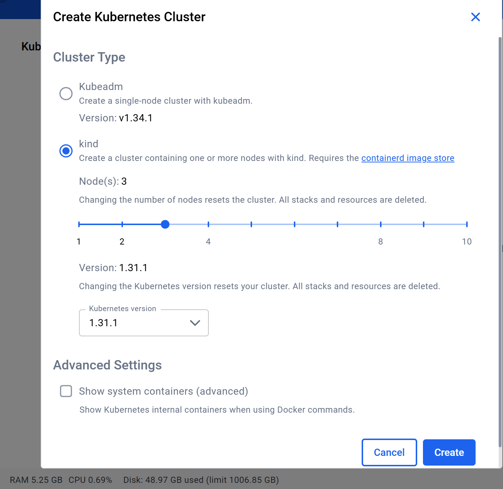

# 通过kind 安装kafka集群

##  安装kind k8s集群


## 部署kafka集群
```bash
# 部署
kubectl apply -f kafka-3nodes.yaml

# 删除
kubectl delete -f kafka-3nodes.yaml

# 监控
kubectl get pods -w

# 查看pod kafka0详细信息
kubectl describe pod kafka-0
```

## 获取kafka服务信息

1. 获取kafka服务信息
```bash
# 查看服务
kubectl get svc

# 查看 Kafka 服务端口（应该显示 NodePort 9094）
kubectl get svc kafka-headless
```

2. 获取node ip
```bash
# 查看节点
kubectl get nodes -o wide
```

3. 转发node port
```bash
# 转发node port 9092 到本地 30092
# 可以通过 http://localhost:30092 访问 Kafka 服务
kubectl port-forward svc/kafka-nodeport 30092:9092
```