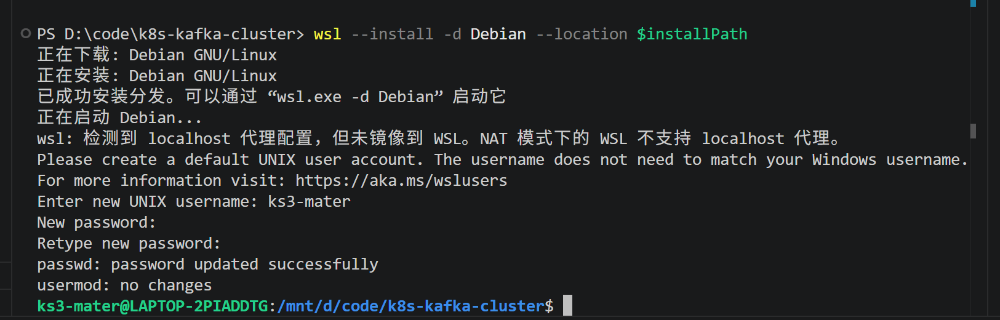

# wsl + debian系统搭建

## 安装master虚拟机和两个k3s-worder虚拟机

### 安装master

```powershell
$basePath="D:\wsl\cluster"
$installPath = Join-Path $basePath "k3s-master"
mkdir $installPath -Force

# 在线导入官方Debian镜像到指定目录
wsl --install -d Debian --location $installPath
```

**设置用户名和密码**
用户名：ks3-mster
密码：123456

详见图

##### 设置国内镜像源

```bash
sudo tee /etc/apt/sources.list.d/debian.sources <<EOF
Types: deb
URIs: https://mirrors.aliyun.com/debian
Suites: bookworm bookworm-updates
Components: main contrib non-free non-free-firmware
EOF

sudo tee -a /etc/apt/sources.list.d/debian.sources <<EOF
Types: deb
URIs: https://mirrors.aliyun.com/debian-security
Suites: bookworm-security
Components: main contrib non-free non-free-firmware
EOF

sudo apt clean
sudo apt update

# 安装curl
sudo apt install -y curl
```


##### 获取k3s-master ip和token名用于安装k3s-worker

```bash
# 获取ip
hostname -I | awk '{print $1}'

# 获取token
sudo cat /var/lib/rancher/k3s/server/node-token
```

### 安装k3s-worker1

```powershell
$basePath="D:\wsl\cluster"
$installPath = Join-Path $basePath "k3s-worker1"
mkdir $installPath -Force

# 在线导入官方Debian镜像到指定目录
wsl --install -d Debian --name k3s-worker1 --location $installPath
```

**设置用户名和密码**
用户名：k3s-worker1
密码：123456

##### 安装k3s-client
```bash
curl -sfL https://get.k3s.io | K3s_URL=https://<Master-IP>:6443 K3s_TOKEN=<Your-Token> sh -
```

## 常见问题

##### k3s安装失败如何卸载？
```bash
# uninstall K3s from a server node
/usr/local/bin/k3s-uninstall.sh

# To uninstall K3s from an agent node
/usr/local/bin/k3s-agent-uninstall.sh
```